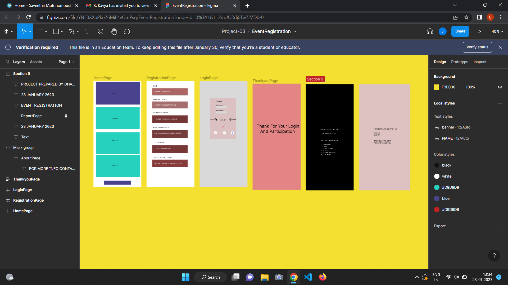

# Event Registration Web Application

## DESCRIPTION:
The Figma Web Page is a sleek and interactive design concept, perfect for showcasing a product or service with a modern and professional touch. Created using Figma's robust design tools, the layout emphasizes user experience and visual appeal. It includes a well-structured homepage with a hero section, feature highlights, and a call-to-action for user engagement. The design features intuitive navigation menus, vibrant visuals, and a responsive structure adaptable for all devices. Supporting sections like "About Us," "Products/Services," and "Contact" ensure comprehensive information delivery. The prototype also integrates placeholder elements for dynamic content, enhancing flexibility for developers. This project reflects best practices in UI/UX design, focusing on clarity, functionality, and aesthetics.

## OUTPUT:

